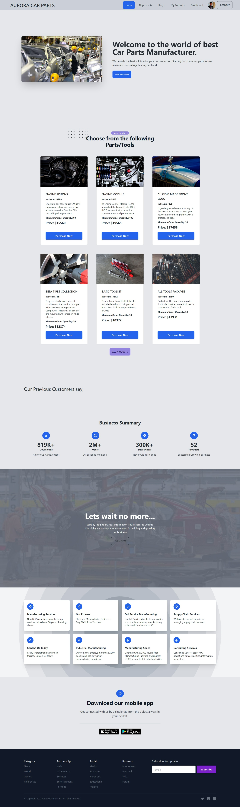

# Aurora Car Parts - client

## Table of Contents

- [Overview](#overview)
  - [Screenshot](#home-page-preview)
  - [Links](#links)
- [My process](#my-process)
  - [Built with](#built-with)
  - [Features](#features)

----

## Overview

Welcome to my website on creating a manufacturer website.

## Links

- Live Site Link: [Click Here](https://aurora-car-parts.firebaseapp.com/) to see the Live website.
- Client side Github Repo: [Click Here](https://github.com/programming-hero-web-course1/manufacturer-website-client-side-kamrulsaad) to check my client side github repo for this project.
- Server side Github Repo: [Click Here](https://github.com/programming-hero-web-course1/manufacturer-website-server-side-kamrulsaad) to check my server side github repo for this project.

## Home Page Preview

----

## My Process

I have built this website following the requirements provided.

## Built With

- `react`, `react-dom`
- `react-router`
- `firebase`
- `react-firebase-hooks`
- `tailwindCSS`
- `tw-elements`
- `daisyUI` 
- `kitwind UI`
- `sweet alert2`
- `react-toastify` 
- `jwt`
- `node`
- `mongoDB`
- `cors`
- `express`
- `heroku`
- `imgbb`
- `photopea`
- `tinypng`
- ``react-rating-star-component`

------

## Features

Users should be able to:

- See a Beautiful home page
- Log in using google account
- Create account with Email and password 
- Recieve email for email-verification 
- Browser through different pages with great user experience
- Add Item to the database
- Choose a order amount between minimum amount and maximum available in stock
- Update their profile information including profile picture upload
- Admins can make another user as admin
- Admins have access to various extra features than normal logged in user
- Admin can approve or delete any order
- Admin can update, add product 
- Make Payment through credit card
- Check the items added by the particular user
- Delete item from the inventory
- Add a review with dynamic rating system
